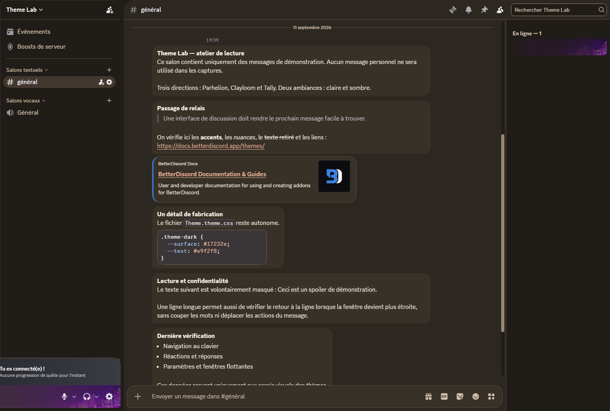
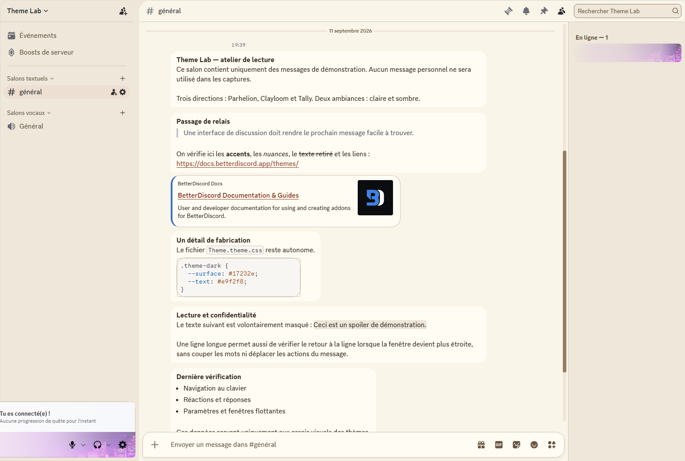
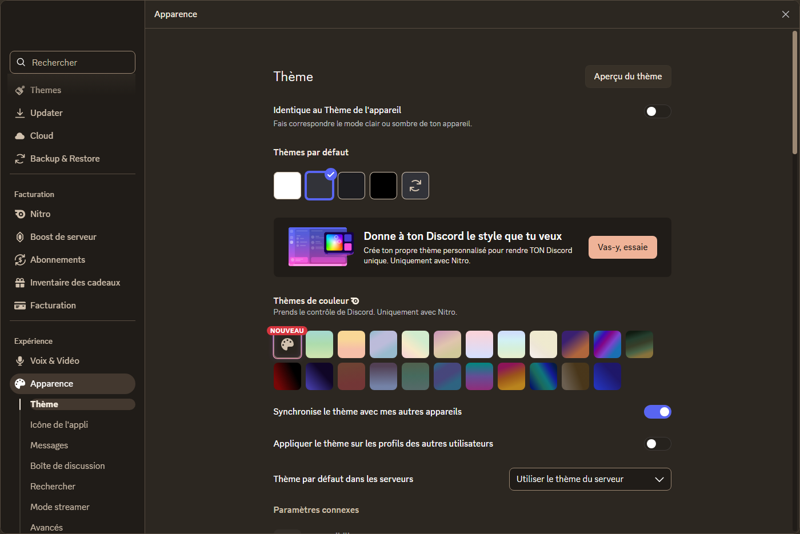
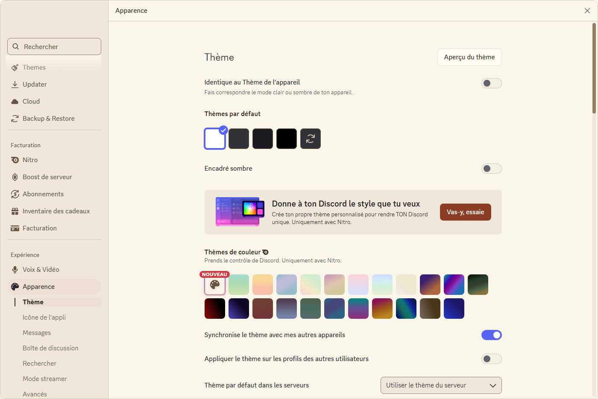

# Clayloom

Make yourself comfortable.

Clayloom uses cream and espresso surfaces, terracotta accents and rounded navigation. Soft message blocks, an asymmetric composer and generous picker surfaces carry the rounded geometry.

**Version 0.1.0.** See [QA](docs/QA.md) for verified surfaces and limitations.

## Screenshots



| Light conversation | Dark settings | Light settings |
|---|---|---|
|  |  |  |

Real Discord Desktop captures from the isolated Theme Lab server. Demonstration messages were posted with permission. Account names, avatars and profile identifiers are masked; the unrelated guild rail is cropped out. No mock interface is used.

## Install

Download [Clayloom.theme.css](https://raw.githubusercontent.com/ussmarines/DiscordTheme-test-2/main/dist/Clayloom.theme.css). Install only one full theme at a time.

- **BetterDiscord:** Settings → Themes → Open Themes Folder. Copy the file there and enable it.
- **Vencord local:** Settings → Vencord → Themes → Local Themes → Open Themes Folder. Copy the file and enable it.
- **Vencord online:** add the following URL under Online Themes, one URL per line:

```text
https://raw.githubusercontent.com/ussmarines/DiscordTheme-test-2/main/dist/Clayloom.theme.css
```

Light and dark follow Discord Appearance. Restart/reload the theme if its manager has cached an older version. Local files update by replacement; Online Themes follows the main branch. There is no remote CSS import inside the downloaded file, so an offline copy remains usable.

## Customize

Add overrides in BetterDiscord Custom CSS or Vencord QuickCSS, after the theme. Keep separate accents for light and dark.

```css
:root {
  --cl-accent-dark: #efb398;
  --cl-accent-light: #8a3d24;
  --cl-radius: 20px;
  --cl-panel-gap: 12px;
  --cl-motion: 180ms;
}
```

Use 0–16px for panel gap; corners are designed around the supplied value. Keep motion below 200ms. Changing accents requires checking link, button and focus contrast again. Discord's own font scale and density remain the primary reading controls.

## Coverage and troubleshooting

Semantic tokens cover conversation, settings, menus, inputs and member surfaces. Dedicated rules shape navigation, composer, reactions, embeds, profiles, voice panels and mod cards. This is not an official or store-approved theme.

If a Discord update changes a surface, disable other themes, reload this theme and compare against native Discord. Report the affected surface, mode and client version without personal messages or identifiers. [Selector map](docs/SELECTOR-MAP.md) records fragile selectors.

No blur or transparency effects are used. No external font, image or script requests are made by the CSS. No FPS or RAM improvement is claimed.

## Build and maintain

Node 22 or newer. Run `npm ci`, `npm run build`, then `npm test`. The build itself uses only Node built-ins; css-tree is a development-only syntax validator. Sources are ordered explicitly in the build script. See [architecture](docs/ARCHITECTURE.md) and [design](docs/DESIGN.md).

## Support and credits

<!-- donation:start -->
Donations are not configured: `PAYPAL_DONATION_URL` is missing.
<!-- donation:end -->

A real PayPal URL belongs in `theme.json`; rebuilding updates both the theme metadata and this section. Unsplash is not a payment link.

Original CSS and logo, MIT licensed. [Credits and research](CREDITS.md).
